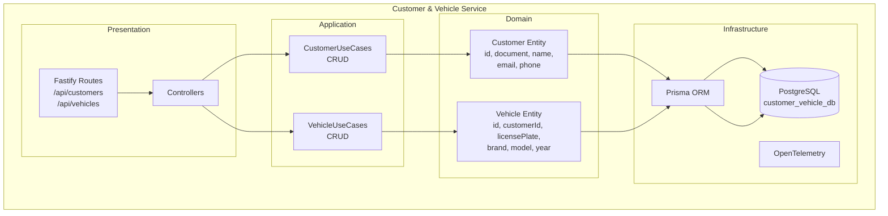
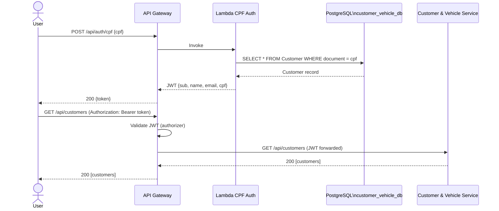

# Customer & Vehicle Service

> Microserviço responsável pelo cadastro e gestão de clientes e veículos da oficina, servindo também como fonte de dados para autenticação via Lambda.

## Sumário

- [1. Visão Geral](#1-visão-geral)
- [2. Arquitetura](#2-arquitetura)
- [3. Tecnologias Utilizadas](#3-tecnologias-utilizadas)
- [4. Comunicação entre Serviços](#4-comunicação-entre-serviços)
- [5. Diagramas](#5-diagramas)
- [6. Execução e Setup](#6-execução-e-setup)
- [7. Pontos de Atenção](#7-pontos-de-atenção)
- [8. Boas Práticas e Padrões](#8-boas-práticas-e-padrões)
- [9. Repositórios Relacionados](#9-repositórios-relacionados)

---

## 1. Visão Geral

### Propósito

O **Customer & Vehicle Service** é o repositório central de clientes e veículos do sistema. Ele é responsável por:

1. **Gerenciar clientes** — criação, consulta e atualização de dados cadastrais (nome, CPF, e-mail, telefone)
2. **Gerenciar veículos** — associação de veículos a clientes (placa, marca, modelo, ano)
3. **Prover dados para autenticação** — a mesma base de dados é consultada pela Lambda de autenticação CPF

### Problema que Resolve

O cadastro de clientes e veículos é o ponto de entrada do ciclo de serviço: sem esse registro, não é possível abrir uma OS. Este serviço isola completamente esse contexto, garantindo:

- Validação de CPF único por cliente
- Validação de placa única por veículo
- Separação do banco de dados de negócio do banco de autenticação (são o mesmo neste caso, por design)

### Papel na Arquitetura

| Papel                      | Descrição                                                            |
| -------------------------- | -------------------------------------------------------------------- |
| **Master data**            | Fonte de verdade para dados de clientes e veículos                   |
| **Provedor de identidade** | A tabela `Customer` é consultada pela Lambda via CPF para emitir JWT |
| **API REST pura**          | Sem mensageria — toda comunicação é síncrona via HTTP                |

---

## 2. Arquitetura

### Clean Architecture

O serviço adota **Clean Architecture** com separação explícita de camadas:

```
src/
├── domain/
│   ├── entities/       # Customer, Vehicle
│   ├── enums/          # (nenhum, estrutura simples)
│   └── use-cases/
│       ├── customer/   # CreateCustomer, GetCustomer, UpdateCustomer, DeleteCustomer
│       └── vehicle/    # CreateVehicle, GetVehicle, UpdateVehicle, DeleteVehicle
├── application/        # Implementações dos use cases
├── infra/
│   ├── db/             # Prisma client, repositórios (CustomerRepository, VehicleRepository)
│   └── observability/
├── presentation/       # Controllers HTTP (Fastify route adapters)
├── validation/         # Schemas Zod
└── main/               # Composition root
```

### Decisões Arquiteturais

| Decisão                            | Justificativa                                                                      | Trade-off                                                                               |
| ---------------------------------- | ---------------------------------------------------------------------------------- | --------------------------------------------------------------------------------------- |
| **Sem mensageria**                 | Clientes e veículos são dados estáticos de cadastro; não há workflow reativo       | Outros serviços não são notificados de mudanças; devem consultar via HTTP se necessário |
| **PostgreSQL + Prisma**            | Relacionamento Customer → Vehicles com integridade referencial garantida           | Overhead de ORM para CRUD simples                                                       |
| **CPF como campo único**           | Identificador de negócio imutável; também chave de autenticação                    | Formato fixo brasileiro (11 dígitos); restringe internacionalização                     |
| **Banco compartilhado com Lambda** | Lambda acessa o mesmo PostgreSQL via `pg` para autenticação sem chamada HTTP extra | Acoplamento de esquema entre Lambda e serviço; migração do schema afeta ambos           |

---

## 3. Tecnologias Utilizadas

| Tecnologia        | Versão | Propósito                           |
| ----------------- | ------ | ----------------------------------- |
| **Node.js**       | 22     | Runtime                             |
| **TypeScript**    | 5.9    | Linguagem                           |
| **Fastify**       | 5.2    | Framework HTTP                      |
| **Prisma**        | 7      | ORM — Customer, Vehicle             |
| **PostgreSQL**    | 16     | Banco de dados relacional           |
| **Zod**           | 4      | Validação de schemas                |
| **OpenTelemetry** | 1.x    | Rastreamento distribuído e métricas |
| **Jest**          | 30     | Testes unitários                    |

**Infraestrutura**: PostgreSQL (RDS em produção, `customer_vehicle_db`), EKS, ECR.

---

## 4. Comunicação entre Serviços

### Sem Mensageria

Este serviço **não publica nem consome eventos**. Toda comunicação é síncrona via HTTP.

### Endpoints REST

| Método   | Rota                 | Descrição             | Auth    |
| -------- | -------------------- | --------------------- | ------- |
| `POST`   | `/api/customers`     | Criar cliente         | JWT     |
| `GET`    | `/api/customers`     | Listar clientes       | JWT     |
| `GET`    | `/api/customers/:id` | Buscar cliente por ID | JWT     |
| `PUT`    | `/api/customers/:id` | Atualizar cliente     | JWT     |
| `DELETE` | `/api/customers/:id` | Remover cliente       | JWT     |
| `POST`   | `/api/vehicles`      | Criar veículo         | JWT     |
| `GET`    | `/api/vehicles`      | Listar veículos       | JWT     |
| `GET`    | `/api/vehicles/:id`  | Buscar veículo por ID | JWT     |
| `PUT`    | `/api/vehicles/:id`  | Atualizar veículo     | JWT     |
| `DELETE` | `/api/vehicles/:id`  | Remover veículo       | JWT     |
| `GET`    | `/health`            | Health check          | Público |

### Dependências de Runtime

| Serviço               | Tipo de Dependência        | Descrição                                           |
| --------------------- | -------------------------- | --------------------------------------------------- |
| **Lambda (CPF Auth)** | Compartilha banco de dados | Lê tabela `Customer` por CPF para autenticar        |
| **API Gateway**       | Proxy HTTP                 | Roteia chamadas externas; valida JWT via authorizer |

---

## 5. Diagramas

### Arquitetura do Serviço



### Integração com Lambda de Autenticação



---

## 6. Execução e Setup

### Pré-requisitos

- Node.js 22+, Yarn 1.22+
- PostgreSQL 16 (ou via Docker Compose)
- Variáveis de ambiente configuradas

### Rodando Localmente

```bash
# Instalar dependências
yarn install

# Gerar o Prisma Client
yarn prisma:generate

# Rodar migrações
yarn prisma:migrate

# Iniciar em modo desenvolvimento
yarn dev

# Build para produção
yarn build && yarn start
```

### Via Docker Compose

```bash
docker compose up -d --build
docker compose logs -f
docker compose down -v
```

### Variáveis de Ambiente

Copie `.env.example` para `.env` e preencha:

| Variável                      | Descrição                    | Obrigatório           |
| ----------------------------- | ---------------------------- | --------------------- |
| `SERVER_PORT`                 | Porta HTTP do serviço        | Sim (default: `3001`) |
| `DATABASE_URL`                | Connection string PostgreSQL | Sim                   |
| `JWT_ACCESS_TOKEN_SECRET`     | Chave de verificação JWT     | Sim                   |
| `OTEL_EXPORTER_OTLP_ENDPOINT` | Endpoint do OTel Collector   | Não                   |
| `LOG_LEVEL`                   | Nível de log                 | Não (default: `info`) |
| `CORS_ORIGIN`                 | Origem CORS permitida        | Não (default: `*`)    |

### Testes

```bash
# Unitários
yarn test

# Com cobertura
yarn test --coverage
```

---

## 7. Pontos de Atenção

### Banco Compartilhado com Lambda

A Lambda de autenticação CPF acessa diretamente o banco `customer_vehicle_db` (tabela `Customer`). Isso significa que:

- **Migrações de schema** precisam ser compatíveis com a Lambda
- O campo `document` (CPF) é a chave de negócio usada para autenticação — não deve ser renomeado ou removido
- A Lambda não usa Prisma — usa queries SQL puras via `pg`

### CPF como Identificador Único

O campo `document` tem constraint `UNIQUE` no banco. Tentativas de cadastrar um cliente com CPF já existente retornam `409 Conflict`. O serviço **não valida o algoritmo do CPF** (verificação de dígitos) — essa validação fica a cargo da Lambda.

### Ausência de Soft Delete

O serviço usa `DELETE` físico para clientes e veículos. Remover um cliente com veículos vinculados requer remoção prévia dos veículos (integridade referencial). Não há soft delete ou histórico de remoções.

### Sem Paginação nos Listagens

O endpoint `GET /api/customers` e `GET /api/vehicles` retornam todos os registros sem paginação. Para volumes grandes, isso pode ser um gargalo. Implemente paginação (`limit`/`offset` ou cursor) antes de ir para produção com muitos clientes.

---

## 8. Boas Práticas e Padrões

### Segurança

- **JWT obrigatório** em todos os endpoints (exceto `/health`)
- **@fastify/helmet**, **@fastify/rate-limit**, **@fastify/cors** habilitados
- Nenhuma senha ou dado sensível armazenado

### Validação

- Schemas **Zod** em todas as rotas
- `document` validado como string de 14 caracteres (CPF com máscara) ou 11 dígitos
- `licensePlate` validado como string de 7 caracteres
- `year` validado como inteiro (SmallInt no banco)

### Logging e Observabilidade

- Logger **Pino** com JSON estruturado
- **OpenTelemetry** → OTLP → Prometheus → Grafana
- Traces por requisição HTTP com request ID

### Tratamento de Erros

- Erros de constraint de banco traduzidos para `409 Conflict` com mensagem descritiva
- Erros de validação retornam `400` com detalhes dos campos inválidos
- Entidades não encontradas retornam `404` com mensagem clara

---

## 9. Repositórios Relacionados

Este repositório faz parte do ecossistema **Auto Repair Shop**. Abaixo estão os demais repositórios da arquitetura final:

| Repositório                                                                                                                    | Descrição                                                       |
| ------------------------------------------------------------------------------------------------------------------------------ | --------------------------------------------------------------- |
| [fiap-13soat-auto-repair-shop-execution-service](https://github.com/vctrlima/fiap-13soat-auto-repair-shop-execution-service)   | Rastreamento de execução dos serviços e notificações por e-mail |
| [fiap-13soat-auto-repair-shop-billing-service](https://github.com/vctrlima/fiap-13soat-auto-repair-shop-billing-service)       | Geração de faturas e processamento de pagamentos                |
| [fiap-13soat-auto-repair-shop-work-order-service](https://github.com/vctrlima/fiap-13soat-auto-repair-shop-work-order-service) | Ordens de serviço e Saga Orchestrator                           |
| [fiap-13soat-auto-repair-shop-lambda](https://github.com/vctrlima/fiap-13soat-auto-repair-shop-lambda)                         | Autenticação de clientes por CPF (AWS Lambda)                   |
| [fiap-13soat-auto-repair-shop-k8s](https://github.com/vctrlima/fiap-13soat-auto-repair-shop-k8s)                               | Infraestrutura AWS — VPC, EKS, ALB, API Gateway                 |
| [fiap-13soat-auto-repair-shop-db](https://github.com/vctrlima/fiap-13soat-auto-repair-shop-db)                                 | Banco de dados RDS PostgreSQL e migrações Flyway                |
